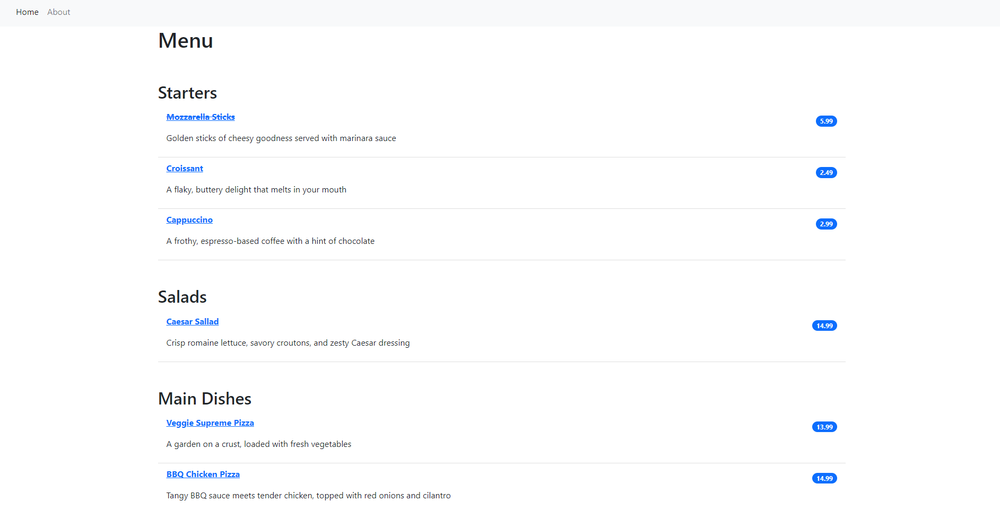

# About this repository

This repository contains a django web app designed to simulate a restaurant menu. The `Home` page looks like the one shown below.

### Features:-
- The app has a navigation menu. The `About` page is just a page with some text.
- Each of the menu items can be clicked to open in a separate page. No additional information is provided on these pages
- Unavailable menu items are shown using a strikethrough(eg ~~Mozzarella Sticks~~)
- The admin user can access the interface where they can add the item, their description, price and availability.

# How to run
after cloning it to a local repository, the web app can be launched using:
<code>python manage.py runserver<code>

# Dependencies
<pre>
    asgiref==3.7.2 
    Django==4.2.6
    sqlparse==0.4.4
    tzdata==2023.3
</pre>
The `requirements.txt` file is also included.